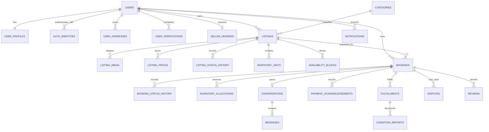
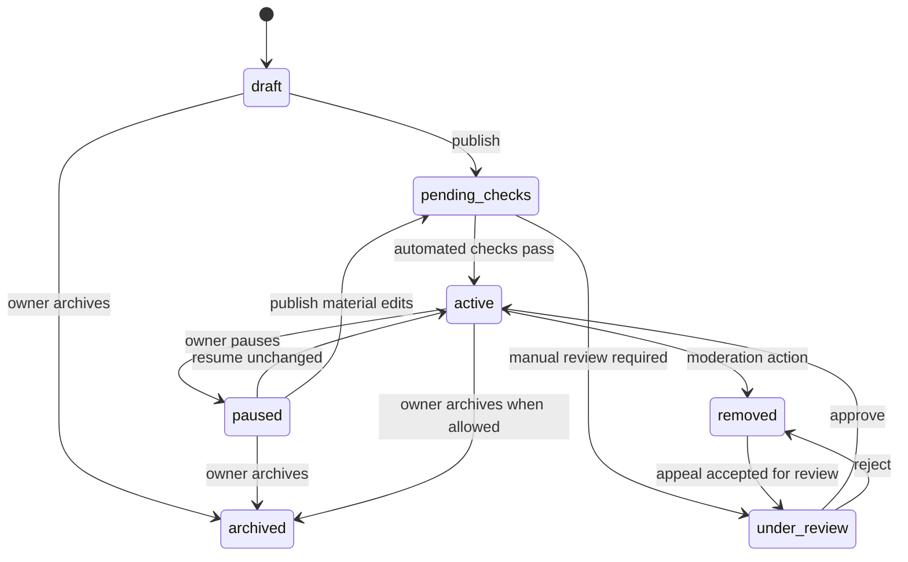

# Database Relationships

## Document Status

- Specification status: Active target model
- Implementation status: Identity, catalog, booking, booking-scoped messaging, fulfillment, trust, staff, and moderation-audit tables implemented
- Existing migrations: PostgreSQL/PostGIS migrations `20260916_0001` through `20260916_0005` applied locally
- Status source: [Implementation Plan](IMPLEMENTATION_PLAN.md)

## Scope

PostgreSQL with PostGIS is the system of record. Alembic migrations define the schema. The implementation tracker distinguishes the tables already present from target fields and related tables that remain planned.

All primary keys should use UUIDs or time-sortable UUID-compatible identifiers. Persist timestamps in UTC and include `created_at` and `updated_at` where mutable records require them.

## Implemented Schema Inventory

Migrations `20260916_0001` through `20260916_0005` currently create:

- Identity: `users`, `user_profiles`, `auth_identities`, `auth_sessions`, `otp_challenges`, `user_addresses`
- Catalog: `categories`, `listings`, `listing_prices`, `listing_status_history`, `availability_blocks`, `seller_headers`
- Booking and messaging: `booking_quotes`, `bookings`, `booking_status_history`, `inventory_allocations`, `conversations`, `messages`
- Fulfillment: `fulfillments`, `handover_challenges`, `handover_confirmations`, `condition_reports`, `payment_acknowledgements`
- Trust and administration: `reviews`, `disputes`, `reports`, `platform_staff`, `moderation_actions`

The relationship diagram and sections below also include target tables and richer target fields. Not-yet-implemented tables include `user_verifications`, `category_attributes`, `listing_media`, `inventory_units`, `availability_rules`, `booking_participants`, `condition_report_media`, `notifications`, `notification_preferences`, `dispute_evidence`, `audit_events`, `outbox_events`, and `idempotency_keys`.

## Relationship Overview

## Identity

### `users`

Stable account identity and lifecycle status.

Key fields: `id`, `status`, `preferred_language`, `last_active_at`, timestamps.

Do not put password hashes, OTPs, or government identifiers directly on this table.

### `user_profiles`

One-to-one profile with display name, avatar object key, approximate home locality, and profile completion state. Date of birth should be stored only when required for an approved age-control purpose.

### `auth_identities`

One user can have multiple login methods.

Key fields: `user_id`, `type`, normalized identifier, verification timestamp, password hash where applicable. Unique constraints apply to normalized email and E.164 mobile identities.

### `auth_sessions`

Server-side sessions with client type (`mobile`, `customer_web`, or `admin_web`), token-family identifier where applicable, secure credential digest, device or browser metadata, expiry, rotation, and revocation state.

### `otp_challenges`

Short-lived OTP digest, purpose, attempt count, expiry, consumed timestamp, and abuse-control dimensions. Expired records are retained only as long as needed for security analysis.

### `user_addresses`

Private saved addresses with structured Indian address fields, postal code, PostGIS point, label, and verification metadata. Addresses are never embedded into public listing responses.

### `user_verifications`

Verification type, provider reference, status, assurance level, expiry, and private evidence references. Store only the minimum provider result and masked identifiers needed for the approved purpose.

## Seller Presentation

### `seller_headers`

Optional one-to-one public presentation metadata for a user who lists multiple items.

Key fields: `user_id`, public display name, short description, cover object key, public locality label, optional operating hours, visibility state, moderation state, and version. Display names are not unique; moderation signals and stable user IDs handle impersonation risk. It does not own listings, create staff access, or represent a separate authorization boundary.

## Catalog

### `categories`

Hierarchical category tree with slug, enabled state, risk tier, listing-review mode, allowed pricing units, required verification, and policy metadata.

### `category_attributes`

Defines typed fields required by a category, such as power rating, size, safety certification, brand, model, or included accessories. Validation rules are structured data, not executable client input.

### `listings`

Key fields include:

- Required `owner_user_id`
- `category_id`, title, description, condition, replacement value, and currency
- Quantity, minimum and maximum duration, lead time, and turnaround buffer
- Pickup and owner-managed-delivery flags
- Approximate public location and private fulfillment location reference
- Canonical status: `draft`, `pending_checks`, `under_review`, `active`, `paused`, `archived`, or `removed`
- Version number for optimistic concurrency where needed

Owner identity, category, and currency cannot change after an active booking exists without creating a new listing version or successor.

Only `active` listings are searchable or can produce new quotes. Existing booking snapshots remain available after pause, archive, or removal.

### `listing_status_history`

Append-only listing transition history with previous and new status, actor, reason code, moderation or appeal reference, request ID, and timestamp.

### `listing_media`

Private object key, media type, sort order, scan status, moderation status, dimensions, checksum, and derivative metadata.

### `listing_prices`

Versioned pricing rule with unit (`hour`, `day`, `week`, or `month`), duration bounds, rental amount, optional deposit, currency, effective interval, and active state.

### `inventory_units`

Optional individually tracked units for serial-numbered or high-value items. Commodity listings can allocate quantity without exposing a unit identity before handover.

Current status: target-only. The current implementation allocates quantities at listing level through `inventory_allocations`.

### `availability_rules`

Recurring weekly availability, booking notice, maximum future booking window, and fulfillment windows.

### `availability_blocks`

Maintenance, owner-use, holiday, or administrative blocks with interval, quantity, reason, and actor.

## Booking and Availability

### `booking_quotes`

Immutable short-lived calculation of dates, quantity, rental charge, deposit, delivery charge, tax, fee rule, currency, and expiry. Creating a booking consumes a valid quote.

### `bookings`

Key fields include renter, listing, owner snapshot, requested interval, quantity, fulfillment method, canonical status, payment-at-pickup state, policy snapshots, totals, currency, expiry, and row version. Canonical statuses are `requested`, `accepted`, `ready_for_handover`, `active`, `return_pending`, `inspection`, `completed`, `rejected`, `expired`, `cancelled`, `overdue`, and `disputed`.

All client-visible booking numbers are opaque and separate from primary keys.

### `booking_status_history`

Append-only transition history with `from_status`, `to_status`, actor, reason code, note, request ID, and timestamp.

### `inventory_allocations`

Links a booking to inventory capacity for a time range. It records quantity, hold or confirmed state, expiry, and optional inventory units.

PostgreSQL range types and exclusion constraints should be used for individually tracked units. Quantity-based inventory still requires a serialized acceptance transaction that sums overlapping allocations under a lock.

### `booking_participants`

Materialized participant access for the renter and owner where conversation and fulfillment access must be revocable and auditable.

## Fulfillment

### `fulfillments`

Pickup or owner-managed delivery method, scheduled windows, private addresses, fee snapshot, state, and fulfillment assignee. No platform-driver assignment exists in MVP.

### `handover_challenges`

Short-lived secure challenge digest, purpose, expiry, attempt limit, consumed state, and participant confirmations.

### `condition_reports`

Handover or return report with checklist, notes, actor, condition grade, timestamp, and immutable evidence references.

### `condition_report_media`

Private media evidence with scan state, checksum, capture metadata, and retention or legal-hold status.

Current status: target-only. `condition_reports` currently store structured checklist JSON and notes without media.

## Messaging and Notifications

### `conversations`

One booking-scoped conversation for its authorized participants. General unsolicited direct messaging is outside MVP.

### `messages`

Sender, body or attachment reference, moderation signals, sent timestamp, edit/tombstone state, and client-generated idempotency identifier.

### `notifications`

Recipient, event type, template version, payload reference, channel, delivery state, deduplication key, and read timestamp.

Current status: target-only; no notification or outbox tables exist.

### `notification_preferences`

Per-user channel preferences. Transactional and safety notices may have different opt-out rules from marketing messages.

## Payment-at-Pickup Records

### `payment_acknowledgements`

Append-only booking record for the agreed rental charge, delivery charge, optional deposit, currency, acknowledgement type, actor, timestamp, and disagreement state. It records what participants confirmed during handover; it does not prove that the platform processed, held, settled, guaranteed, or refunded money.

## Trust and Operations

### `reviews`

Booking-linked reviewer and subject, rating, text, moderation state, and timestamps. Unique reviewer/subject/booking relationship.

### `reports`

Reporter, target type, target ID, reason, narrative, triage priority, status, and assignment.

### `disputes`

Booking, opener, dispute type, requested resolution, state, assigned agent, decision, and appeal state.

### `dispute_evidence`

Private evidence reference, submitting actor, evidence type, scan state, retention hold, and timestamp.

### `moderation_actions`

Append-only target, action, reason code, actor, duration, evidence, and appeal relationship.

### `audit_events`

Append-only security and administrative event with actor, action, target, request ID, source context, timestamp, and redacted metadata.

### `outbox_events`

Domain event type, aggregate, payload, occurrence time, processing attempts, next attempt, processed time, and dead-letter state.

Current status: target-only; worker technology and provider choices remain open.

### `idempotency_keys`

Actor, operation, key, request digest, stored response reference, status, and expiry. A key reused with a different request digest must fail.

## Critical Constraints

1. A listing belongs to exactly one user account.
2. A seller header never grants access to another user.
3. Booking status and payment-at-pickup acknowledgement remain separate.
4. A booking preserves price, policy, listing, owner, and fulfillment snapshots.
5. Only valid server-side transitions can change booking status.
6. Confirmed allocations cannot exceed inventory for overlapping time ranges.
7. Financial and status history records are append-only.
8. Reviews require a completed booking and authorized participant.
9. MVP records cannot represent a platform-processed online payment.
10. Precise addresses, identity evidence, and restricted media are never public fields.

## Important Indexes

- Unique normalized email and E.164 mobile identities
- GiST indexes for listing location and allocation time ranges
- Search indexes for listing title, description, category, and active state
- Composite booking indexes by renter/status/date and owner/status/date
- Partial indexes for active listings, active holds, pending outbox events, and unread notifications
- Unique command idempotency keys
- Conversation messages by conversation and creation time
- Moderation and dispute queues by status, priority, and age

## Retention and Deletion

Account deletion should deactivate access and schedule eligible personal data for deletion or anonymization. Financial, fraud, dispute, tax, and audit records may require longer retention. Legal and dispute holds override normal object deletion until released by an authorized workflow.
