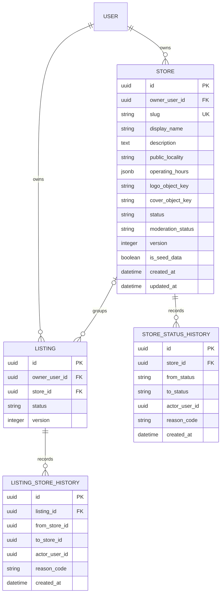

# Multi-Store Implementation Plan

## Document Control

- Product: 4by4 For Hire
- Plan date: 2026-09-20
- Status: Version 2 in progress — backend foundation and shared contracts are locally verified; the first mobile owner workflow is implemented and typechecked
- Version: v2 adds shared API-client methods, mobile store creation/listing, listing-create store selection, and listing-edit reassignment. Public storefronts, advanced store dashboards/media/lifecycle controls, customer web, and admin surfaces remain planned.
- Scope: Backend, shared API client, Expo mobile app, customer web app, admin moderation, tests, and documentation
- Prerequisite: Product owner approval was provided on 2026-09-20 for owner store creation and listing assignment.
- Implementation claim: The backend `stores` domain, Alembic migration, shared contracts/client, and initial mobile owner workflow are implemented and locally verified. Mobile users can list/create stores and assign a store during listing creation or editing. The complete dashboard, public storefront, customer web, admin moderation integration, and store media UI remain planned. Nothing described here is staged or deployed.

This document is the implementation handoff for owner-operated rental storefronts. It supplements the main implementation tracker and does not change current implementation status by itself.

## 1. Product Decision

A signed-in user may own multiple stores. A store groups and presents listings but does not replace the user as the owner of inventory, bookings, offers, messages, reviews, or payment acknowledgements.

The first release uses these rules:

1. A user may own up to five stores. Keep the limit configurable.
2. A listing always has one `owner_user_id` and may have zero or one `store_id`.
3. A listing may move between stores owned by the same user or return to personal-listing status.
4. Personal listings remain supported.
5. Stores may contain item and service listings.
6. Store staff, branches, delegated access, ownership transfer, separate store login, store wallets, online payments, and store-specific reviews are not included.
7. Booking, offer, conversation, fulfillment, review, dispute, and report ownership continues to use the listing owner's user ID.
8. Existing listings remain personal until their owner assigns them to a store.
9. Existing seller headers remain supported during the first store release and are not automatically converted.

## 2. Goals

- Let a user create, edit, pause, resume, archive, and view multiple stores.
- Let an owner add, remove, and move owned listings between stores.
- Show store attribution on discovery cards, maps, listing details, offers, and booking context.
- Provide a public storefront with store presentation and active listings.
- Preserve existing personal-listing behavior and existing booking workflows.
- Keep all authorization server-side and derived from `ActorContext`.
- Preserve private media and location boundaries.
- Maintain optimistic concurrency and append-only audit evidence.

## 3. Non-Goals

- A store is not a legal identity or authentication principal.
- A store does not own a listing independently of a user.
- A store cannot employ staff or delegate management.
- A store cannot have branches or branch-level inventory.
- A store cannot receive or settle money.
- Store-level ratings and reviews are deferred.
- Store subscriptions, commissions, featured placement, analytics, and advertising are deferred.
- Automatic conversion of seller headers or existing listings is deferred.

## 4. Core Domain Invariants

1. `Listing.owner_user_id` remains non-null and authoritative.
2. When `Listing.store_id` is non-null, that store must have the same `owner_user_id`.
3. Clients never provide or override `owner_user_id`.
4. A store assignment never changes booking, offer, conversation, or fulfillment ownership.
5. Store operations never delete listings, bookings, messages, offers, reviews, disputes, or fulfillment records.
6. Public APIs return only active, moderation-approved stores.
7. Public listing APIs return an attached listing only when both the listing and store are publicly active.
8. Owner APIs may return paused and archived stores and private listing states.
9. Store names may repeat; canonical slugs are globally unique and immutable in the first release.
10. Store locality is presentation metadata. The listing's public locality remains authoritative for that listing.

## 5. User Journeys

### 5.1 Create a Store

1. User opens Account > My Stores.
2. The page lists existing stores and offers Create store while below the configured limit.
3. User enters store name, description, public locality, operating hours, logo, and cover image.
4. API creates the store in active state and returns its canonical slug.
5. User lands on the owner store dashboard.

Store creation must not require the user to create or move a listing.

### 5.2 Publish a Listing Under a Store

1. The listing form shows a Publish as selector.
2. Options are Personal listing, each active owned store, and Create another store.
3. The selected store ID is submitted with the listing create request.
4. The backend verifies store ownership in the same transaction as listing creation.
5. Public listing responses include a compact store summary.

### 5.3 Manage Store Inventory

The owner store dashboard provides:

- Store header and current status.
- Counts for draft, active, paused, and archived listings.
- Add item or service.
- Search and filter store listings.
- Edit each listing through the existing listing editor.
- Pause, resume, publish, or archive each listing through existing transitions.
- Move selected listing to another owned store.
- Remove selected listing from the store and keep it as a personal listing.

### 5.4 Public Storefront

The public storefront displays:

- Store logo, cover, name, description, locality, and operating hours.
- Active item and service listings.
- Search and item/service filtering within the store.
- A safe link to the owner's existing public trust/profile information where applicable.

It must not expose email, mobile number, private address, exact coordinates, drafts, paused listings, booking history, or object-storage keys.

### 5.5 Pause and Resume

- Pausing a store does not mutate each listing's lifecycle status.
- Attached listings are excluded from public search, public listing detail, maps, and the public storefront while the store is paused.
- Existing owners, renters with bookings, conversations, offers, and fulfillment records retain their existing authenticated access.
- Resuming restores public visibility for attached listings whose own status is active.

### 5.6 Archive

Archiving is an idempotent transaction:

1. Mark the store archived.
2. Detach all attached listings by setting `store_id` to null.
3. Preserve each listing's status and user ownership.
4. Record one store status-history event and one listing-store-history event per detached listing.
5. Delete no media or business records.

The confirmation UI must say that listings will remain available as personal listings according to their existing status. There is no user-facing hard-delete operation in the first release.

## 6. Data Model



### 6.1 `stores`

Create a new `stores` table:

| Column | Type | Rules |
| --- | --- | --- |
| `id` | UUID | Primary key |
| `owner_user_id` | UUID | Required FK to `users.id`, `ON DELETE RESTRICT` |
| `slug` | varchar(100) | Required, canonical lowercase, globally unique, immutable |
| `display_name` | varchar(120) | Required, 2-120 characters |
| `description` | text | Required default empty, maximum 1200 characters at API boundary |
| `public_locality` | varchar(160) | Required; no precise address |
| `operating_hours` | JSONB | Required default `{}`, validated by Pydantic |
| `logo_object_key` | varchar(512) | Nullable private object key |
| `cover_object_key` | varchar(512) | Nullable private object key |
| `status` | varchar(24) | `active`, `paused`, or `archived` |
| `moderation_status` | varchar(24) | `active`, `under_review`, or `removed` |
| `version` | integer | Required default 1, positive |
| `is_seed_data` | boolean | Required default false |
| `created_at` | timestamptz | Server default now |
| `updated_at` | timestamptz | Server default now and update timestamp |

Constraints and indexes:

- Unique index on canonical `slug`.
- Index on `(owner_user_id, status)`.
- Index on `(status, moderation_status)` for public reads.
- Unique constraint on `(id, owner_user_id)` to support tenant-safe listing association.
- Store-count limit is enforced by the service from configuration, not a hard-coded database check.

### 6.2 `listings.store_id`

Add nullable `store_id` to `listings` and index `(store_id, status)`.

Use a composite foreign key from `(store_id, owner_user_id)` to `stores(id, owner_user_id)`. This prevents a listing from being attached to another user's store even if service validation regresses. Use `ON DELETE RESTRICT`; user-facing archive detaches listings explicitly before any retention-time deletion.

Add a `store` relationship on `Listing` and eager-load it in list/detail/search queries to avoid per-listing queries.

### 6.3 Audit Tables

Create `store_status_history` for store lifecycle changes and `listing_store_history` for assignments, removals, moves, and archive-time detachments.

Do not record store movement in `listing_status_history`, because moving a listing does not change its listing status.

History rows are append-only and are not removed when a store is archived.

## 7. Store State Machine

```text
active --pause--> paused
paused --resume--> active
active --archive--> archived
paused --archive--> archived
```

- Archived is terminal in the first release.
- Repeated pause, resume, and archive commands should return the current state without duplicating history.
- Moderation status is independent of owner-controlled status.
- Public visibility requires `status = active` and `moderation_status = active`.

## 8. API Contract

All paths are under `/api/v1`.

### 8.1 Owner Store Endpoints

| Method | Path | Purpose |
| --- | --- | --- |
| `GET` | `/me/stores` | List all stores owned by the actor |
| `POST` | `/me/stores` | Create a store |
| `GET` | `/me/stores/{store_id}` | Owner store detail and listing counts |
| `PATCH` | `/me/stores/{store_id}` | Version-aware metadata update |
| `POST` | `/me/stores/{store_id}/pause` | Pause public store visibility |
| `POST` | `/me/stores/{store_id}/resume` | Resume public visibility |
| `POST` | `/me/stores/{store_id}/archive` | Archive and detach listings |
| `GET` | `/me/stores/{store_id}/listings` | Owner listing inventory with status filter |
| `POST` | `/me/stores/{store_id}/logo` | Upload/replace logo |
| `DELETE` | `/me/stores/{store_id}/logo` | Remove logo |
| `POST` | `/me/stores/{store_id}/cover` | Upload/replace cover |
| `DELETE` | `/me/stores/{store_id}/cover` | Remove cover |

Owner mutations use the existing `require_csrf` dependency and server-derived `ActorContext`. Owner reads use `require_actor`.

### 8.2 Listing Assignment Endpoint

Use one idempotent command instead of separate add, remove, and move routes:

```text
PUT /me/listings/{listing_id}/store
```

Request:

```json
{
  "store_id": "uuid-or-null",
  "listing_version": 3
}
```

Behavior:

- A UUID attaches or moves the listing to an active store owned by the actor.
- `null` removes the listing from its current store.
- Reject stale `listing_version` with 409.
- Increment the listing version after a successful assignment change.
- Repeating an already-applied assignment is successful and does not duplicate history.
- Return the complete `ListingResponse`.

`ListingCreateRequest` also accepts optional `store_id`. Normal listing updates do not move stores; movement remains an explicit command.

### 8.3 Public Endpoints

| Method | Path | Purpose |
| --- | --- | --- |
| `GET` | `/stores/{slug}` | Public active store profile and counts |
| `GET` | `/stores/{slug}/listings` | Paginated active store listings |

Use `slug`, not owner ID, for public URLs. Return 404 for paused, archived, under-review, or removed stores to avoid status disclosure.

### 8.4 Listing Responses

Add nullable store attribution to `ListingResponse`:

```json
{
  "store": {
    "id": "uuid",
    "slug": "chennai-tool-rentals",
    "display_name": "Chennai Tool Rentals",
    "logo_url": "short-lived-authorized-url-or-null",
    "public_locality": "Chennai"
  }
}
```

Return `store: null` for personal listings. Do not return raw object keys.

### 8.5 Schemas

Add:

- `StoreCreateRequest`
- `StoreUpdateRequest`
- `StoreHoursInput`
- `StoreSummaryResponse`
- `StoreOwnerResponse`
- `StorePublicResponse`
- `StoreListingCountsResponse`
- `ListingStoreAssignmentRequest`

Validation rules:

- Normalize whitespace in display name and locality.
- Generate slug server-side from name with a collision-safe suffix.
- Validate operating-hours keys and `HH:MM` values; do not accept arbitrary JSON.
- Require `version` for store metadata updates.
- Limit logo/cover to JPEG, PNG, or WebP and 8 MB, matching listing image rules.

### 8.6 Error Codes

| HTTP | Code | Meaning |
| --- | --- | --- |
| 404 | `STORE_NOT_FOUND` | Store is unavailable or not visible |
| 403 | `STORE_FORBIDDEN` | Actor does not own the store |
| 409 | `STORE_LIMIT_REACHED` | Actor reached configured store limit |
| 409 | `STORE_VERSION_CONFLICT` | Stale metadata version |
| 409 | `STORE_TRANSITION_DENIED` | Invalid state transition |
| 409 | `LISTING_VERSION_CONFLICT` | Stale listing assignment version |
| 409 | `LISTING_STORE_UNCHANGED` | Optional; prefer idempotent success instead |
| 422 | `STORE_MEDIA_TYPE_INVALID` | Unsupported image type |
| 413 | `STORE_MEDIA_TOO_LARGE` | Upload exceeds limit |

Do not reveal whether another user's private store exists; return the established forbidden/not-found behavior consistently.

## 9. Backend Implementation

### 9.1 Domain Placement

Create a dedicated domain:

```text
backend/app/domains/stores/
  __init__.py
  models.py
  schemas.py
  service.py
  router.py
```

Keep listing assignment in `StoreService` because it enforces the store invariant, while existing listing content and lifecycle remain in `CatalogService`.

### 9.2 Migration

Create the next available Alembic revision after the repository's actual head. At plan creation, the observed head file is `20260921_0001_booking_note.py`; the implementer must recheck before generating a revision.

Upgrade order:

1. Create `stores`.
2. Add store indexes and constraints.
3. Add nullable `listings.store_id`.
4. Add composite listing/store ownership foreign key.
5. Create `store_status_history`.
6. Create `listing_store_history`.
7. Add any required report-target constraint change for store reports.

No existing-row backfill is required because `store_id` is nullable.

Downgrade must first drop the listing composite FK and `store_id`, then history tables, then stores. Migration tests must run against PostgreSQL.

### 9.3 Models

- Create `Store`, `StoreStatusHistory`, and `ListingStoreHistory` in the stores domain.
- Add nullable `store_id` and `store` relationship to `Listing`.
- Add store relationships only where they prevent repeated queries; avoid broad circular imports.
- Register new models wherever Alembic metadata imports domain models.

### 9.4 Services

Implement `StoreService` methods:

- `create_store(actor, payload)`
- `list_owner_stores(actor_id)`
- `owner_store(store_id, actor_id)`
- `public_store(slug)`
- `update_store(store_id, actor_id, payload)`
- `transition_store(store_id, actor_id, action)`
- `list_owner_store_listings(store_id, actor_id, status, limit, cursor)`
- `list_public_store_listings(slug, limit, cursor)`
- `assign_listing(listing_id, actor_id, store_id, listing_version)`
- `upload_logo`, `remove_logo`, `upload_cover`, `remove_cover`

Service rules:

- Lock the owner store count during creation or use a transaction-safe count strategy to enforce the limit under concurrent requests.
- Verify listing and target-store ownership in the same transaction.
- Use optimistic version checks for store updates and listing assignment.
- Archive and detach listings atomically.
- Append history only when state or assignment changes.
- Delete replaced media from object storage only after the database change is safe; keep provider failures recoverable.
- Public list queries must eager-load category, prices, images, and store summary.

### 9.5 Catalog Changes

Update:

- `backend/app/domains/catalog/models.py`
- `backend/app/domains/catalog/schemas.py`
- `backend/app/domains/catalog/service.py`
- `backend/app/domains/catalog/router.py`

Required changes:

- Accept optional `store_id` on create.
- Verify store ownership before inserting the listing.
- Include `StoreSummaryResponse | None` in listing responses.
- Eager-load store data in search, public detail, and owner-list queries.
- Exclude active listings attached to non-public stores from unauthenticated search and detail.
- Add store filtering to owner inventory without changing existing `/me/listings` behavior.
- Preserve current risk-tier publishing and listing transitions.

### 9.6 Router Registration

Register the stores router in `backend/app/api/v1/router.py`. Keep route ordering unambiguous between `/me/stores/...` and `/stores/{slug}`.

### 9.7 Seller Header Compatibility

Do not repurpose `SellerHeader` into `Store`. Their cardinality and semantics differ.

- Preserve `/me/seller-header` and `/sellers/{user_id}` for compatibility.
- A store-attached listing uses store attribution.
- A personal listing may continue using seller-header presentation.
- Do not auto-create a store from a seller header.
- Add a later, separately approved deprecation/migration plan if seller headers become redundant.

### 9.8 Trust and Moderation

Extend report target validation to support stores if the existing target-type constraint is closed. Add store summaries to the existing admin report queue and allow authorized staff to set `moderation_status` with reason-coded audit evidence.

Store moderation must not mutate listing ownership or historical bookings. Removed stores are not public, but attached records remain available to authorized participants and staff.

## 10. Shared Contracts and API Client

After backend routes and schemas are stable:

1. Run `npm run contracts:generate`.
2. Review `packages/contracts/openapi.json`.
3. Review generated changes in `packages/contracts/src/generated.ts`.
4. Add exported store request/response aliases to `packages/api-client/src/index.ts`.
5. Add API-client methods for all owner/public store routes, assignment, and media uploads.
6. Run `npm run contracts:check` to prove no drift.

Do not hand-write generated contract types.

## 11. Mobile Implementation

### 11.1 Routes

Create:

```text
apps/mobile/src/app/stores/index.tsx
apps/mobile/src/app/stores/create.tsx
apps/mobile/src/app/stores/[id].tsx
apps/mobile/src/app/stores/[id]/edit.tsx
apps/mobile/src/app/store/[slug].tsx
```

Register routes in `apps/mobile/src/app/_layout.tsx` where explicit stack registration is used.

### 11.2 Account

Update `apps/mobile/src/app/(tabs)/account.tsx`:

- Add My Stores menu row.
- Show store count and a compact preview when signed in.
- Keep About, profile, offers, notifications, and blocked users available.
- Do not fetch each store separately; use `GET /me/stores` once.

### 11.3 Store List and Dashboard

Owner store list:

- Store logo, name, locality, state, and active-listing count.
- Create button hidden/disabled at configured limit.
- Clear empty, loading, error, and retry states.

Owner dashboard:

- Store presentation header.
- Active/draft/paused/archived count filters.
- Listing rows with image, price, status, Edit, Move, Remove, and lifecycle actions.
- Pause/resume/archive controls with confirmation dialogs.
- Archive confirmation explains that listings become personal.

### 11.4 Listing Create and Edit

Update `apps/mobile/src/app/(tabs)/list-item.tsx`:

- Load active owned stores after authentication.
- Add a store selector with Personal listing as the default.
- Provide Create store without discarding entered listing data.
- Submit optional `store_id` in `ListingCreateRequest`.

Update owner listing management to use the assignment endpoint for moves. Do not overload the normal listing PATCH request.

### 11.5 Public Attribution

Update:

- `apps/mobile/src/app/(tabs)/index.tsx`
- `apps/mobile/src/app/(tabs)/explore.tsx`
- `apps/mobile/src/app/listing/[id].tsx`
- Relevant booking, offer, and message headers where listing context is shown

Render `From {store.display_name}` only when store is present. Make it pressable and navigate to `/store/{slug}`. Personal listings retain existing seller presentation.

### 11.6 Storefront Design

The public storefront should use one unframed cover/header area followed by filter controls and a listing grid/list. Avoid nested cards. Required states:

- Loading skeleton.
- Active store with no listings.
- Store not found/unavailable.
- Image failure fallback.
- Pagination/loading-more state.

## 12. Customer Web Implementation

Create:

```text
apps/web/src/app/(app)/stores/page.tsx
apps/web/src/app/(app)/stores/new/page.tsx
apps/web/src/app/(app)/stores/[id]/page.tsx
apps/web/src/app/(app)/stores/[id]/edit/page.tsx
apps/web/src/app/(public)/stores/[slug]/page.tsx
```

Update account navigation and listing creation/editing to support store selection and movement.

Public storefront requirements:

- Canonical URL by slug.
- Server-rendered title and description metadata.
- Active listings only.
- No indexing for unavailable stores.
- Responsive 360 px and desktop layouts.
- No private identity or precise-location leakage.

## 13. Admin Web Implementation

Extend the existing reports/moderation surfaces only as needed:

- Show store target summaries in reports.
- Link to a staff-only store moderation detail.
- Allow reason-coded `under_review`, `active`, and `removed` transitions.
- Do not give staff inventory-management actions through the customer store API.

A general store-management admin console is out of scope unless separately approved.

## 14. Migration and Compatibility Strategy

### Release A: Additive Foundation

- Deploy nullable schema and store APIs.
- Existing listings and clients continue to work.
- Listing responses add nullable store summary.
- Seller-header endpoints remain unchanged.

### Release B: Owner Management

- Release mobile and web store management.
- Allow users to create stores and opt listings into them.
- Do not automatically move existing listings.

### Release C: Public Attribution

- Enable store attribution in discovery and public storefront routes.
- Verify paused/removed store filtering before rollout.
- Add store report target support.

### Rollback

- Disable store creation and assignment through a feature flag.
- Keep nullable schema in place during rollback.
- Existing assigned listings remain user-owned and bookable according to the selected visibility policy.
- If a full rollback is required, detach listings transactionally before dropping schema in a later maintenance release.

## 15. Security and Privacy Requirements

- Derive owner identity from `ActorContext`; never accept owner IDs from clients.
- Verify both listing ownership and store ownership on every assignment.
- Enforce same-owner association in PostgreSQL with a composite FK.
- Keep logo and cover objects private and return short-lived URLs.
- Never log object URLs, private addresses, tokens, or contact details.
- Do not expose exact store or listing coordinates on public store responses.
- Apply existing block-user behavior based on the user owner; a store cannot bypass blocks.
- Preserve CSRF rules for browser mutations and bearer-session rules for mobile.
- Rate-limit store creation, slug probing, and media uploads.
- Apply moderation and prohibited-content policies to store names, descriptions, logos, and covers.
- Keep archive history and listing movement history append-only.

## 16. Test Plan

### 16.1 Migration Tests

- Upgrade from the current head to the store revision on PostgreSQL.
- Downgrade one revision and re-upgrade.
- Existing listings remain with `store_id = null`.
- Composite FK rejects cross-owner store assignment at database level.
- Store deletion is restricted while listings remain attached.

### 16.2 Backend Service/API Tests

Create focused store tests under `backend/tests/` covering:

1. One user creates multiple stores.
2. Configured store limit is enforced under normal and concurrent requests.
3. Slug generation handles duplicates deterministically.
4. User A cannot read owner detail for User B's store.
5. User A cannot update, pause, resume, archive, or upload media to User B's store.
6. User A cannot assign a listing to User B's store.
7. Listing create accepts an owned active store.
8. Listing create rejects paused, archived, under-review, and removed stores.
9. Assignment moves a listing between two owned stores.
10. Assignment with null returns a listing to personal status.
11. Repeated assignment is idempotent and produces no duplicate history.
12. Stale listing and store versions return 409.
13. Pausing hides store and attached listings from public APIs.
14. Pausing does not break existing booking, offer, message, or fulfillment access.
15. Resuming restores only listings whose own status is active.
16. Archiving detaches all listings and preserves their status.
17. Archive is atomic and idempotent.
18. Public storefront excludes drafts, paused, archived, removed, and seed data for normal users.
19. Public responses contain no private identity, address, coordinates, or object keys.
20. Store media type, size, ownership, replacement, and deletion rules work.
21. Existing personal listings and seller-header routes remain compatible.
22. Search and detail use eager loading and avoid per-row store queries.
23. Store report and moderation transitions enforce staff permissions.

### 16.3 API Client Tests

- Store methods send correct paths, verbs, auth, CSRF, and multipart bodies.
- Assignment serializes explicit null correctly.
- Generated contract drift check passes.

### 16.4 Mobile Tests

- Create two stores from one account.
- Create listings under different stores.
- Create a personal listing.
- Edit, move, and remove listings from a store.
- Pause/resume a store and verify public behavior.
- Archive a store and verify listings appear as personal.
- Store attribution navigates from home, Explore, map, and detail.
- Loading, empty, failure, retry, and image-fallback states render.
- Store form and cards fit supported Android viewport sizes.

### 16.5 Web Playwright Tests

- Owner creates multiple stores and manages their listings.
- Cross-user owner routes are denied.
- Anonymous visitor opens a canonical public storefront.
- Paused/removed storefront returns unavailable and is not indexed.
- Personal and store listings coexist in discovery.
- Archive confirmation and post-archive listing behavior are correct.
- Public storefront has no horizontal overflow at 360 px and 1280 px.

## 17. Documentation Updates Required During Implementation

Update these source-of-truth files when implementation begins:

- `docs/PRODUCT_REQUIREMENTS.md`: move owner-operated multi-store storefronts out of deferred scope; keep staff, branches, transfers, and store payments deferred.
- `docs/IMPLEMENTATION_PLAN.md`: add store work packages using the repository status vocabulary.
- `docs/TECHNICAL_ARCHITECTURE.md`: add stores domain and ownership boundary.
- `docs/DATABASE_RELATIONSHIPS.md`: add Store and audit relationships.
- `docs/API_DESIGN.md`: add owner/public endpoints and error codes.
- `docs/SECURITY_PAYMENTS_AND_TRUST.md`: add store authorization, media, moderation, and privacy boundaries.
- `docs/UI_UX_PLAN.md`: add My Stores, listing selector, owner dashboard, and public storefront journeys.

`docs/STORE_LISTING.md` concerns app-store submission and should not be used for this feature.

## 18. Work Packages and Order

| ID | Work package | Initial status | Depends on | Completion evidence |
| --- | --- | --- | --- | --- |
| STR-00 | Approve multi-store scope and update source requirements | Planned | Product owner | Docs consistently define approved boundaries |
| STR-01 | Add stores, history, and listing association migration | Implemented — locally verified | STR-00 | PostgreSQL upgrade/downgrade and FK tests pass |
| STR-02 | Implement store models, schemas, service, and owner authorization | Implemented — locally verified | STR-01 | Focused CRUD, limit, concurrency, and denial tests pass |
| STR-03 | Implement assignment, pause/resume/archive, and public visibility | Implemented — locally verified | STR-02 | Assignment/history/visibility tests pass |
| STR-04 | Implement store media and moderation/report integration | Partially implemented — media upload/validation verified; report/moderation-queue integration with the `trust` domain not started | STR-02 | Media authorization and moderation tests pass |
| STR-05 | Generate contracts and extend the shared API client | Planned | STR-03, STR-04 | Contract drift, API client typecheck, and tests pass |
| STR-06 | Build mobile owner store workflows | Planned | STR-05 | Mobile typecheck/lint and device workflow evidence pass |
| STR-07 | Add mobile public attribution and storefront | Planned | STR-05 | Discovery/detail/storefront journeys pass |
| STR-08 | Build customer web owner and public workflows | Planned | STR-05 | Build and Playwright store journeys pass |
| STR-09 | Add admin store moderation support | Planned | STR-04, STR-05 | Staff authorization and moderation journeys pass |
| STR-10 | Complete compatibility, security, and release verification | Planned | STR-06 through STR-09 | Approved local suites pass; status docs updated accurately |

Recommended implementation sequence:

1. STR-00.
2. STR-01.
3. STR-02 and focused validation.
4. STR-03 and focused validation.
5. STR-04.
6. STR-05.
7. STR-06 and STR-08 in parallel.
8. STR-07.
9. STR-09.
10. STR-10.

## 19. Validation Commands

Run narrow checks after each slice, then the complete approved checks before deployment.

```bash
# Focused backend store tests
cd backend && ../.venv/bin/pytest -q tests/test_stores.py

# PostgreSQL integration tests
TEST_DATABASE_URL="$DATABASE_URL" npm run backend:test:integration

# Migrations
npm run db:upgrade
npm run db:current
npm run db:downgrade
npm run db:upgrade

# Contract generation and drift
npm run contracts:generate
npm run contracts:check

# Mobile
npm run typecheck --workspace mobile
npm run lint --workspace mobile

# Customer web
npm run typecheck --workspace web
npm run build --workspace web
npm run test:e2e --workspace web

# Backend quality
npm run backend:lint
npm run backend:typecheck
npm run backend:test

# Complete workspace gate
npm run check
```

Before deployment, also complete supported-device mobile journeys and the repository's release checks. Do not deploy as part of implementation unless explicitly requested.

## 20. Definition of Done

The multi-store feature is complete only when:

- Product and architecture documents consistently approve owner-operated multiple stores.
- One user can create and manage multiple stores up to the configured limit.
- Personal listings and seller-header compatibility remain intact.
- A listing can be created under, moved between, or removed from owned stores.
- PostgreSQL prevents cross-owner listing/store association.
- Store pause, resume, archive, and moderation visibility match this plan.
- Archive preserves listings and all downstream records.
- Public discovery and detail show correct store attribution without private data.
- Mobile and web provide owner management and public storefront experiences.
- Admin moderation can process store reports without granting customer inventory access.
- Alembic, focused backend tests, contract drift, TypeScript, builds, Playwright, and mobile device journeys pass.
- Documentation status moves through Planned, In progress, Implemented, Locally verified, and deployment states only when evidence exists.

## 21. Explicit Handoff Warnings

- Do not replace `Listing.owner_user_id` with `store_id`.
- Do not make bookings, offers, messages, fulfillment, or reviews store-owned.
- Do not reuse `SellerHeader` as the Store model.
- Do not use `ON DELETE CASCADE` from stores to listings.
- Do not hard-delete a store through a customer endpoint.
- Do not trust client-provided owner IDs.
- Do not move listings through the normal metadata PATCH endpoint.
- Do not expose storage object keys or precise addresses.
- Do not add staff, branches, delegated access, payments, or store ratings to this slice.
- Do not describe the feature as implemented until code and focused validation exist.
