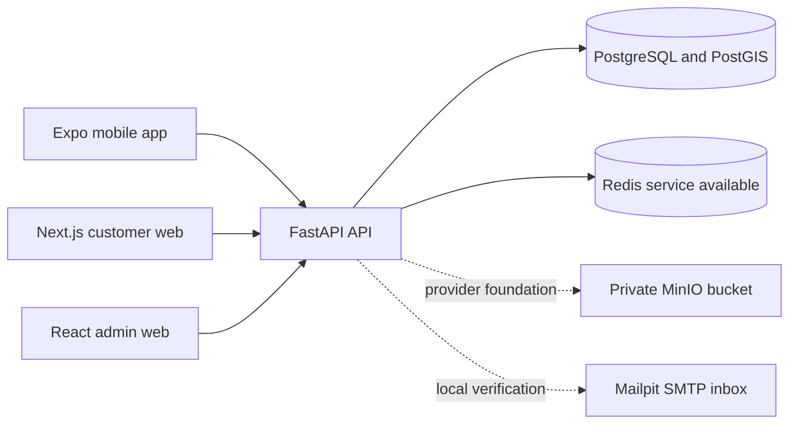
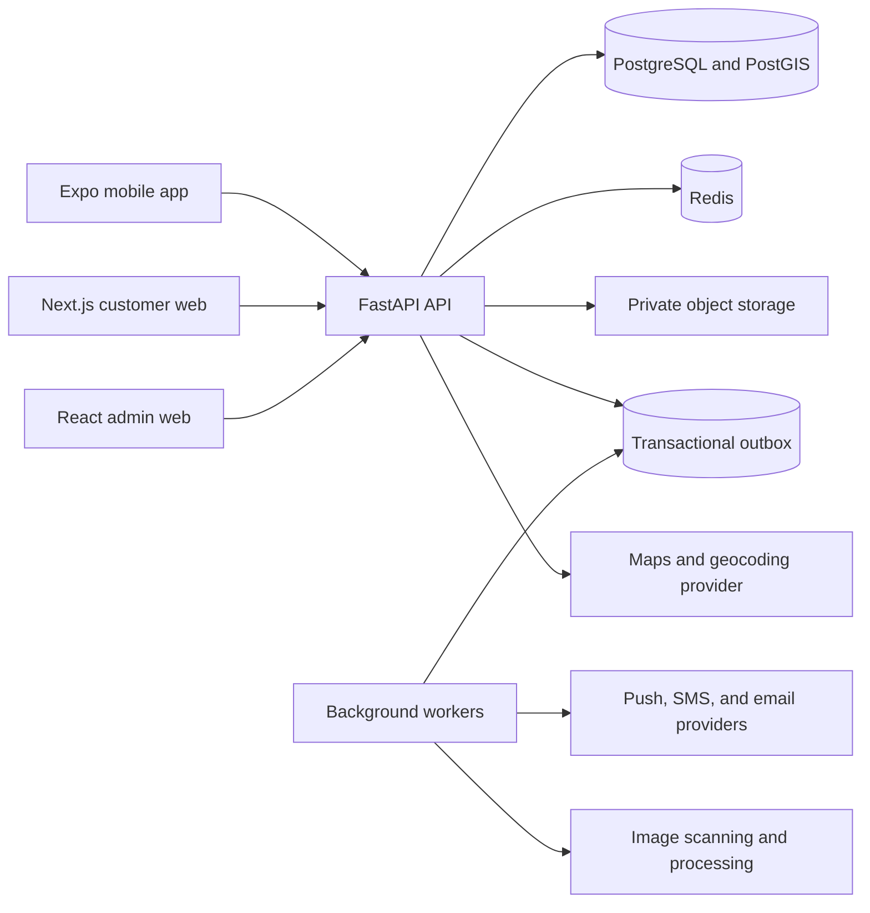

# Technical Architecture

## Document Status

- Specification status: Active target architecture
- Implementation status: Modular FastAPI/PostgreSQL application, identity, catalog, booking, booking-scoped messaging, fulfillment/trust records, generated clients, customer web, Expo mobile, admin web, structured logging, and local infrastructure implemented; media pipeline, outbox/workers, notifications, and production providers remain target components
- Verified environments: Local development only; no staging, pilot, or production environment
- Status source: [Implementation Plan](IMPLEMENTATION_PLAN.md)

This document contains both current and target architecture. The current-state notes and the [Implementation Plan](IMPLEMENTATION_PLAN.md) identify what exists. Target-only components must not be described as implemented or deployed.

## Architecture Goals

The architecture must support a fast Kanyakumari pilot without coupling the product to one city, one payment provider, or one server. The initial implementation should be a modular monolith with explicit domain boundaries and asynchronous workers.

## Current Local System Context



The current API persists business behavior in PostgreSQL. MinIO, Redis, and Mailpit run locally, but listing/evidence media services, an outbox processor, notification delivery, and production provider adapters are not implemented.

## Target System Context



## Recommended Stack

| Area | Choice |
| --- | --- |
| Mobile | React Native, Expo, Expo Router, TypeScript |
| Customer web | Next.js, React, TypeScript, responsive PWA |
| Admin web | React, TypeScript, Vite |
| API | FastAPI, Python 3.12 or current supported version |
| Validation | Pydantic |
| ORM | SQLAlchemy 2.x |
| Database | PostgreSQL with PostGIS |
| Migrations | Alembic |
| Cache and coordination | Redis |
| Background jobs | Celery, Dramatiq, or equivalent Redis-backed worker |
| Object storage | Private Amazon S3 with signed access |
| Delivery | Containers behind HTTPS load balancing |
| Observability | Structured logs, metrics, tracing, error reporting |
| Tests | Pytest, React Native tests, API integration tests, Playwright for customer and admin web |

Provider selection remains configurable. OTP, maps, email, push, and scanning integrations must sit behind small provider interfaces. Future payment, store, and logistics capabilities must be introduced behind new domain boundaries rather than embedded into MVP listing or booking code.

Current implementation uses deterministic local verification-code delivery through Mailpit and no production provider. Background job technology remains undecided; Celery/Dramatiq in the table is a target choice, not an installed runtime.

## Repository Shape

```text
4by4-forhire/
  backend/
    app/
      api/
      domains/
        identity/
        catalog/
        availability/
        bookings/
        fulfillment/
        messaging/
        trust/
        administration/
      integrations/
      workers/
      core/
    alembic/
    tests/
  apps/
    mobile/
      app/
      components/
      features/
    web/
      app/
      components/
      features/
    admin-web/
      src/
  packages/
    api-client/
    contracts/
    design-tokens/
    validation/
  docs/
  deployment/
```

Shared domain contracts and API clients should be generated from the versioned OpenAPI schema where practical. Mobile and web can share contracts, validation, API behavior, and design tokens, but should use platform-native UI components and navigation. Neither client duplicates backend authorization rules.

## Client Responsibilities

### Mobile

- Use Expo Router for native stack and tab navigation.
- Store refresh credentials using platform-secure storage.
- Use native camera, photo library, push notifications, location permission, and deep links.
- Preserve safe drafts locally and retry only idempotent operations.

### Customer Web

- Use Next.js server rendering for public category, listing, and seller pages.
- Use responsive layouts and accessible browser navigation for authenticated workflows.
- Keep authenticated and private responses out of shared caches.
- Store sessions in secure, HTTP-only cookies and apply CSRF protection to state-changing requests.
- Provide web push only as an optional enhancement; in-app and email notices remain available.
- Use canonical URLs and structured metadata for public discovery without exposing private data.

### Admin Web

- Remain a separate permission-scoped operational application.
- Do not share privileged routes, bundles, or cached responses with the public customer web application.

## Backend Boundaries

### Identity

Owns accounts, credentials, OTP challenges, sessions, user profiles, addresses, consent, and verification status.

### Catalog

Owns categories, attributes, listings, media, prices, inventory units, moderation state, and search documents.

### Availability

Owns availability rules, temporary holds, maintenance blocks, quantity calculations, and conflict checks.

### Bookings

Owns quote snapshots, booking requests, state transitions, cancellation, expiry, and booking history.

### Fulfillment

Owns pickup, owner-managed delivery, addresses authorized for a booking, payment-at-handover acknowledgement, handover challenges, condition reports, returns, and overdue events.

### Messaging

Owns booking conversations, messages, attachments, notification preferences, and contact-detail detection.

### Trust

Owns verification requirements, listing reports, user reports, reviews, disputes, evidence, sanctions, and moderation decisions.

### Administration

Provides permission-scoped operational commands and read models. Administrative actions call domain services rather than updating records directly.

## Request and Transaction Rules

- API routes validate transport data and call application services.
- Services own transactions and state transitions.
- Repositories perform scoped persistence and query composition.
- All commands that can be retried accept an idempotency key.
- External side effects are recorded in the same transaction through an outbox.
- Workers claim and process outbox records with retry and dead-letter handling.
- Server time is authoritative; persisted timestamps use UTC.

## Availability and Concurrency

Availability is calculated from listing quantity minus overlapping active allocations and maintenance blocks. Search results may use a cached projection, but booking acceptance must perform an authoritative database check.

The acceptance transaction should:

1. Lock the relevant listing inventory or allocation rows.
2. Recalculate availability for the requested interval and quantity.
3. Create or promote the allocation.
4. Record the booking transition and outbox events.
5. Commit as one transaction.

This transaction is the final defense against double booking. Redis locks may reduce contention but never replace the PostgreSQL constraint and transaction.

## Search and Location

- Store normalized private addresses and PostGIS points separately from public locality labels.
- Search by category, text, availability, price, delivery option, and distance.
- Return approximate distance and locality before booking authorization.
- Never return precise owner coordinates in public listing responses.
- Start with PostgreSQL full-text and trigram search.
- Add a dedicated search service only after measured database limits justify it.

## Media Flow

1. The API creates an upload authorization for a permitted media type and size.
2. The client uploads directly to a private quarantine prefix.
3. A worker scans, validates, strips unsafe metadata, and creates derivatives.
4. Approved media moves to an active private prefix.
5. APIs issue short-lived signed URLs to authorized viewers.
6. Deletion follows retention and dispute-hold rules.

## Authentication and Authorization

- Mobile OTP and verified email/password are supported login methods.
- Use short-lived access tokens and rotating refresh sessions.
- Store refresh tokens in platform-secure storage on mobile.
- Use secure, HTTP-only, `SameSite` cookies and CSRF defenses for web sessions.
- Resolve the authenticated actor server-side.
- Enforce listing and booking ownership in dependencies and services.
- Never trust client-supplied owner IDs, verification levels, payment acknowledgements, or price totals.
- Require step-up authentication for sensitive account and identity actions.

## Real-Time and Notifications

REST remains the source of truth. WebSockets may update booking conversations and status screens. Native push, optional web push, in-app notifications, and email bring users back to the relevant client.

Notification events include booking requested, accepted, rejected, expiring, payment acknowledgement recorded, handover due, return due, overdue, dispute update, and moderation action. User-visible sends must be asynchronous and deduplicated.

## Deployment Evolution

### Pilot

- Containerized API and worker
- Managed PostgreSQL with automated backups
- Private S3 buckets
- Redis with persistence appropriate to job usage
- HTTPS load balancer or managed ingress
- Separate development, staging, and production environments
- Centralized logs, uptime checks, database metrics, and error alerts

### Growth

- Horizontally scale stateless API and worker containers.
- Add read replicas only for measured read pressure.
- Add CDN delivery for authorized media variants.
- Scale and cache public web rendering independently from authenticated API traffic.
- Partition high-volume audit, notification, or event tables when needed.
- Introduce a search engine only when PostgreSQL search no longer meets measured needs.
- Extract services only when ownership, scaling, or reliability demands are proven.

## Reliability and Recovery

- Use multi-availability-zone database deployment for general release.
- Enable point-in-time database recovery and versioned object storage.
- Define recovery time and recovery point objectives before public launch.
- Test restoration in a non-production environment.
- Make job retries safe and observable.
- Use health, readiness, and dependency checks.
- Support feature flags and provider failover for non-core integrations.

## Environment and Secret Rules

- Keep secrets in a managed secret store, never source control or release artifacts.
- Use separate credentials and storage prefixes per environment.
- Restrict database and object-storage roles to required actions.
- Do not log tokens, OTPs, identity documents, full addresses, payment data, or signed URLs.
- Restrict CORS to approved web origins and keep authenticated responses out of public CDN caches.
- Production startup must run migrations as a controlled release step, not create tables automatically.

## Testing Strategy

- Unit-test pricing, availability, risk, and state-transition rules.
- Integration-test PostgreSQL transactions, constraints, migrations, and PostGIS queries.
- Contract-test provider adapters.
- Test authorization denial for unrelated users and listings.
- Test booking acceptance races and idempotent retries.
- Test media authorization and expired signed URLs.
- Test critical mobile flows on Android and iOS.
- Test critical customer web flows at mobile, tablet, and desktop browser widths.
- Test server-rendered metadata, canonical URLs, cache privacy, keyboard access, and browser session protections.
- Run end-to-end tests against local or staging services, never public production data.
